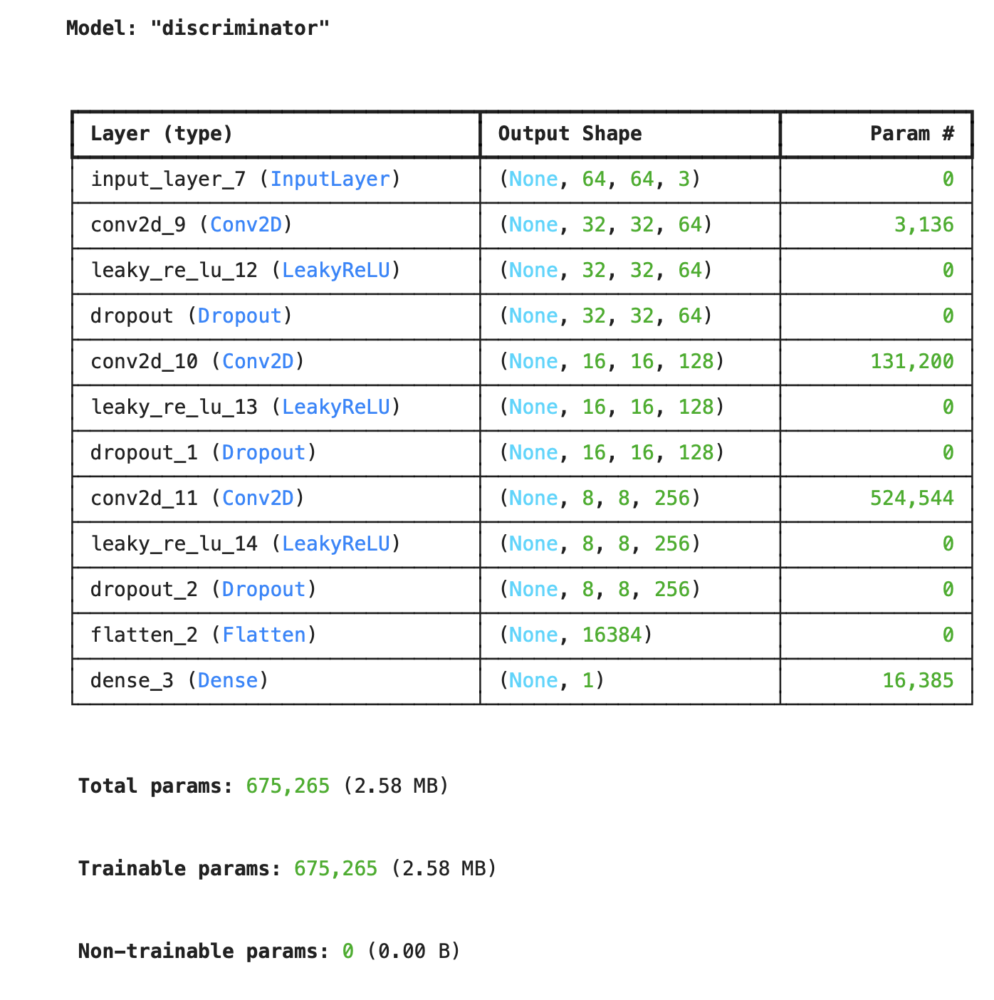
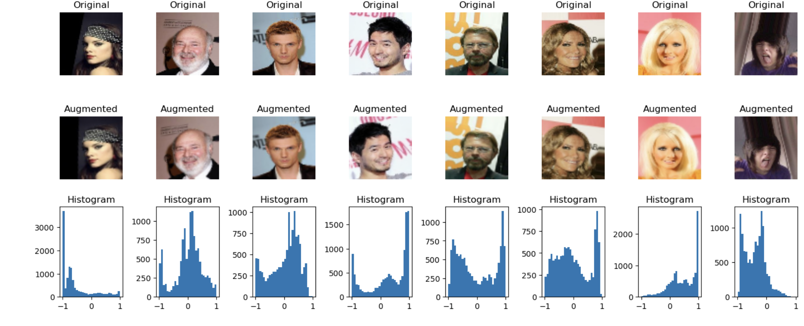
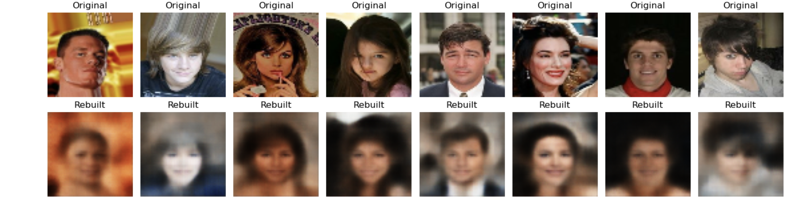

# Generative Autoencoders AI – Autoencoders, VAEs & GANs



## Author

**Darious Brown**

GitHub: https://github.com/Dare215
LinkedIn: https://www.linkedin.com/in/dariousbrown
Portfolio: https://dare215.github.io/DariousBrown-Portfolio/
Email: [dariousbrown3@icloud.com](mailto:dariousbrown3@icloud.com)

---

# Project Overview

This project explores Generative Artificial Intelligence using Autoencoders, Variational Autoencoders (VAEs), and Generative Adversarial Networks (GANs). The objective is to investigate how neural networks learn compressed image representations and generate synthetic facial images from learned latent spaces.

Using the CelebA facial image dataset, multiple deep learning architectures were implemented to perform image reconstruction, data augmentation, feature extraction, and image generation tasks.

The project demonstrates practical applications of generative deep learning and computer vision while highlighting the strengths and limitations of different generative architectures.

---

# Business Problem

Generative AI is transforming industries including healthcare, cybersecurity, media, finance, and manufacturing. Organizations increasingly use generative models for:

* Synthetic data generation
* Data augmentation
* Image reconstruction
* Anomaly detection
* Computer vision applications
* Privacy-preserving AI workflows

This project evaluates how generative neural networks can learn meaningful image representations and generate realistic facial images from training data.

---

# Dataset

The project utilizes the CelebA facial image dataset.

Dataset preparation included:

* Image resizing to 64x64 pixels
* RGB image normalization
* Data augmentation
* Training and validation splits
* Feature extraction and latent space generation

---

# Methodology

## Data Preprocessing

* Loaded facial image dataset
* Normalized pixel values
* Resized images to fixed dimensions
* Applied augmentation techniques
* Prepared tensors for model training

## Autoencoder

Implemented an encoder-decoder architecture to compress images into latent representations and reconstruct the original images.

## Variational Autoencoder (VAE)

Implemented probabilistic latent-space modeling to generate new facial images from sampled latent vectors.

## Generative Adversarial Network (GAN)

Built a Generator and Discriminator network trained through adversarial learning to create synthetic facial images.

---

# Visual Results

## GAN Generated Faces


This visualization demonstrates synthetic facial images generated by the GAN model after training. The Generator learned facial features directly from the training dataset and produced entirely new image samples.

---

## Autoencoder Architecture


This figure illustrates the neural network architecture used during training, including convolutional layers, activation functions, dropout layers, and trainable parameters.

---

## CelebA Dataset Samples



Examples of original facial images, augmented images, and associated pixel intensity distributions used during preprocessing and training.

---

## Autoencoder Reconstructions



Comparison between original facial images and reconstructed outputs generated by the autoencoder. The reconstructed images demonstrate how compressed latent representations preserve important facial features.

---

# Key Findings

* Autoencoders successfully learned compressed facial image representations.
* Reconstructed images retained major facial structures while sacrificing some fine detail.
* GANs generated realistic facial patterns despite limited training epochs.
* Data augmentation improved dataset diversity and model robustness.
* Generative models successfully captured meaningful latent representations of facial features.

---

# Skills Demonstrated

## Artificial Intelligence

* Generative AI
* Deep Learning
* Neural Networks
* Representation Learning

## Computer Vision

* Image Processing
* Image Reconstruction
* Image Generation
* Data Augmentation

## Machine Learning

* Model Training
* Hyperparameter Tuning
* Feature Extraction
* Performance Evaluation

## Python Libraries

* TensorFlow
* Keras
* NumPy
* Pandas
* Matplotlib
* Scikit-Learn

---

# Repository Structure

```text
Autoencoders-Generative-Models/
│
├── notebook/
│   └── Autoencoders_Generative_Models.ipynb
│
├── visuals/
│   ├── GANGeneratedFaces.png
│   ├── AutoencoderArchitecture.png
│   ├── CelebADatasetSamples.png
│   └── AutoencoderReconstructions.png
│
├── README.md
├── requirements.txt
└── .gitignore
```

# Installation

```bash
git clone https://github.com/Dare215/Autoencoders-Generative-Models.git

cd Autoencoders-Generative-Models

pip install -r requirements.txt

jupyter notebook
```

Open:

```text
notebook/Autoencoders_Generative_Models.ipynb
```

# Future Improvements

* Train GANs for additional epochs
* Improve image sharpness and resolution
* Implement convolutional VAEs
* Add latent space visualization
* Calculate reconstruction error metrics
* Deploy a Streamlit-based image generation application

---

# Author

## Darious Brown

PhD Candidate – Artificial Intelligence & Machine Learning

DBA Candidate

Data Scientist | Machine Learning Engineer | AI Researcher

### Professional Profiles

GitHub: https://github.com/Dare215

LinkedIn: https://www.linkedin.com/in/dariousbrown

Portfolio: https://dare215.github.io/DariousBrown-Portfolio/

Email: [dariousbrown3@icloud.com](mailto:dariousbrown3@icloud.com)

---

# License

This repository is intended for educational, research, and portfolio demonstration purposes.


**GitHub:** https://github.com/Dare215  
**LinkedIn:** https://www.linkedin.com/in/dariousbrown  
**Portfolio:** https://dare215.github.io/DariousBrown-Portfolio/  
**Email:** dariousbrown3@icloud.com  

### Areas of Expertise

- Artificial Intelligence
- Machine Learning
- Deep Learning
- Generative AI
- Natural Language Processing
- Computer Vision
- Predictive Analytics
- Data Science
- Financial Analytics
- Healthcare Analytics
- Manufacturing Analytics

---

# License

This project is intended for educational, research, and portfolio demonstration purposes.
