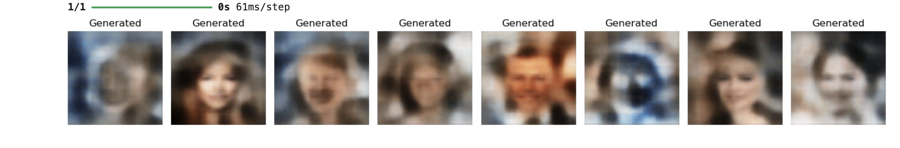

# Generative Autoencoders AI – Autoencoders, VAEs & GANs


## Author

**Darious Brown**

**GitHub:** https://github.com/Dare215  
**LinkedIn:** https://www.linkedin.com/in/dariousbrown  
**Portfolio:** https://dare215.github.io/DariousBrown-Portfolio/  
**Email:** dariousbrown3@icloud.com  

---

# Project Overview

Generative Autoencoders AI explores deep learning image generation and reconstruction using Autoencoders, Variational Autoencoders (VAEs), and Generative Adversarial Networks (GANs).

This project applies neural network architectures to facial image data to evaluate how deep learning models can compress, reconstruct, and generate new image representations.

The project demonstrates foundational generative AI workflows including image preprocessing, latent space representation, reconstruction quality, and synthetic image generation.

---

# Business Problem

Generative AI models are increasingly used across industries for image synthesis, anomaly detection, compression, data augmentation, and representation learning.

This project explores key questions:

- Can neural networks learn compressed image representations?
- How well can an autoencoder reconstruct facial images?
- Can a VAE generate new image-like samples from latent vectors?
- Can a GAN learn to produce synthetic face-like outputs?
- How do generative models differ in reconstruction and image generation quality?

---

# Dataset

The project uses facial image data processed into 64x64 RGB image format.

The workflow includes:

- Image loading
- Image resizing
- Normalization
- Data augmentation
- Training/test preparation
- Latent space generation

---

# Methodology

## Data Preparation

- Loaded facial image data
- Resized images to 64x64
- Normalized image pixel values
- Applied augmentation techniques
- Prepared image batches for model training

## Autoencoder Modeling

- Built an encoder-decoder architecture
- Compressed facial images into latent representations
- Reconstructed original images from learned encodings
- Compared original vs reconstructed outputs

## Variational Autoencoder Modeling

- Created latent distribution sampling
- Generated new facial outputs from random latent vectors
- Evaluated generative quality through visual inspection

## GAN Modeling

- Built generator and discriminator models
- Trained adversarial networks
- Generated synthetic face-like image outputs

---

# Visual Analysis

## Generative AI Thumbnail


This visual shows GAN-generated facial image outputs and serves as the primary project thumbnail.

---

## CelebA Dataset Samples


This visualization shows original and augmented facial image samples used during preprocessing.

---

## Autoencoder Reconstructions


This visual compares original facial images against reconstructed images generated by the autoencoder.

---

## VAE Generated Faces



This visualization shows new face-like images generated from random latent vectors using a Variational Autoencoder.

---

## GAN Generated Faces


This visualization demonstrates synthetic face-like outputs produced by the Generative Adversarial Network.

---

# Key Findings

- Autoencoders successfully learned compressed image representations.
- Reconstructed images retained broad facial structure but lost fine detail.
- VAEs generated blurred but face-like outputs from latent space sampling.
- GAN outputs demonstrated generative behavior but required additional training for sharper quality.
- The project demonstrates the practical differences between reconstruction-based and adversarial generative models.

---

# Skills Demonstrated

## Deep Learning

- Autoencoders
- Variational Autoencoders
- Generative Adversarial Networks
- Latent Space Modeling
- Neural Network Architecture Design

## Computer Vision

- Image Preprocessing
- Image Reconstruction
- Image Generation
- Data Augmentation

## Python & AI Frameworks

- TensorFlow
- Keras
- NumPy
- Pandas
- Matplotlib
- Scikit-Learn

---

# Repository Structure

```text
GenerativeAutoencodersAI/
│
├── notebook/
│   └── Autoencoders_Generative_Models.ipynb
│
├── visuals/
│   ├── GenerativeAutoencodersAI.png
│   ├── CelebADatasetSamples.png
│   ├── AutoencoderReconstructions.png
│   ├── VAEGeneratedFaces.png
│   └── GANGeneratedFaces.png
│
├── data/
├── README.md
├── requirements.txt
└── .gitignore
```

---

# Installation

```bash
git clone https://github.com/Dare215/GenerativeAutoencodersAI.git
cd GenerativeAutoencodersAI
pip install -r requirements.txt
jupyter notebook
```

Open:

```text
notebook/Autoencoders_Generative_Models.ipynb
```

---

# Future Improvements

- Train models for additional epochs
- Improve GAN image quality
- Add FID score evaluation
- Add reconstruction loss curves
- Deploy image generation demo with Streamlit
- Experiment with convolutional VAEs
- Add hyperparameter tuning

---

# Author

## Darious Brown

**PhD Candidate – Artificial Intelligence & Machine Learning**  
**DBA Candidate**  
**Data Scientist | Machine Learning Engineer | AI Researcher**

### Professional Profiles

**GitHub:** https://github.com/Dare215  
**LinkedIn:** https://www.linkedin.com/in/dariousbrown  
**Portfolio:** https://dare215.github.io/DariousBrown-Portfolio/  
**Email:** dariousbrown3@icloud.com  

### Areas of Expertise

- Artificial Intelligence
- Machine Learning
- Deep Learning
- Generative AI
- Natural Language Processing
- Computer Vision
- Predictive Analytics
- Data Science
- Financial Analytics
- Healthcare Analytics
- Manufacturing Analytics

---

# License

This project is intended for educational, research, and portfolio demonstration purposes.
